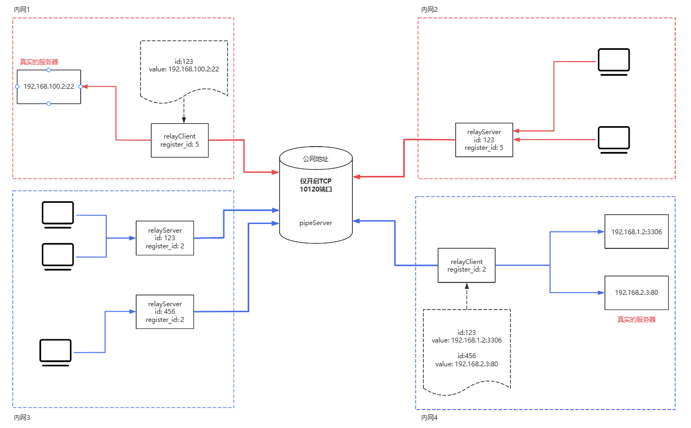

# goRelay

`goRelay`是使用`go`编写的基于TCP的**数据转发**工具。

使用背景：当需要跨网段连接内网的机器的时候，可以使用此工具，该工具提供端到端的通信功能。

使用限制：使用该工具至少需要一台中间服务器，能够相互连通2个内网。

目前已经支持的功能:
- [x] 支持端到端数据加密。
- [x] 支持数据压缩。
- [x] 支持端口数据复用。
- [x] 支持动态转发。
- [x] 动态管理客户端。
- [x] 使用量统计。

## 部署图




## 如何获取可执行文件

### 从已发布的版本中获取

可以从已发布版本中得到符合机器架构的可执行文件：

```bash
➜ ./goRelay_linux_amd64 --help
NAME:
   goRelay - is a TCP-based intranet penetration tool written in go.

USAGE:
   goRelay [global options] command [command options]

COMMANDS:
   pipeServer   pipe server
   relayClient  relay client
   relayServer  relay server
   help, h      Shows a list of commands or help for one command

GLOBAL OPTIONS:
   --version, -v  show version (default: false)
   --help, -h     show help
➜   
```


### 编译获取
将该仓库`clone`下来后，使用`bash build.sh ` + 版本号 进行编译，例如：
```bash
➜  bash build.sh v0.0.1
build project
CGO_ENABLED=0 GOOS=linux GOARCH=amd64 go build -ldflags "-X goRelay/pkg.Version=v0.0.1 -X goRelay/pkg.BuildAt=2025-10-26 -X goRelay/pkg.GitCommit=45aa844460465537396fd72cb46eae294aeab1fc" -o ./bin/goRelay_linux_amd64
build project
CGO_ENABLED=0 GOOS=linux GOARCH=arm64 go build -ldflags "-X goRelay/pkg.Version=v0.0.1 -X goRelay/pkg.BuildAt=2025-10-26 -X goRelay/pkg.GitCommit=45aa844460465537396fd72cb46eae294aeab1fc" -o ./bin/goRelay_linux_arm64
build project
CGO_ENABLED=0 GOOS=windows GOARCH=amd64 go build -ldflags "-X goRelay/pkg.Version=v0.0.1 -X goRelay/pkg.BuildAt=2025-10-26 -X goRelay/pkg.GitCommit=45aa844460465537396fd72cb46eae294aeab1fc" -o ./bin/goRelay_windows_amd64
build project
CGO_ENABLED=0 GOOS=android GOARCH=arm64 go build -ldflags "-X goRelay/pkg.Version=v0.0.1 -X goRelay/pkg.BuildAt=2025-10-26 -X goRelay/pkg.GitCommit=45aa844460465537396fd72cb46eae294aeab1fc" -o ./bin/goRelay_android_arm64
➜  goRelay git:(main) ✗ 
```

编译完成之后，会在`./bin/`下生成对应的二进制文件。
```bash
➜  goRelay git:(main) ✗ ls  bin/goRelay_* 
bin/goRelay_android_arm64  bin/goRelay_linux_amd64  bin/goRelay_linux_arm64  bin/goRelay_windows_amd64
➜  goRelay git:(main) ✗ 
```


## 如何执行
### `pipeServer`
`pipeServer`是管道服务器，用于数据传输，需要部署到2个网络都能访问到的机器上。

启动该服务，需要先创建配置文件，比如该文件名称为：`pipeServerConf.yaml`：

```yaml
# pipeServer、relayClient、relayServer 都需要保持一致，才能进行通信
key: "exampleKey123"

# pipeServer监听的地址
addr: "127.0.0.1:8080"

# IP白名单
white_ip_list:
  - "192.168.1.1"
  - "192.168.1.2"

# IP黑名单 如果相同的IP地址同时出现在黑名单和白名单上，则黑名单优先级高于白名单
black_ip_list:
  - "10.0.0.1"
  - "10.0.0.2"

# 开启debug日志
debug_log: true
```


启动`pipeServer`，只需要指定配置文件即可，例如：
```bash
➜  bin git:(main) ✗ ./goRelay_linux_amd64 pipeServer --conf pipeServerConf.yaml
```

### `relayClient`
`relayClient`是中转客户端，用于接收/发送来自管道客户端、真实服务的数据，需要部署在真实服务所在的内网环境中。

启动该服务，需要配置`relayServer`随指定的`id`,根据`id`的不同，来指定相应的真实服务的地址。

要想启动该服务，需要创建配置文件，比如：`relayClientConf.yaml`：
```yaml
# pipeServer、relayClient、relayServer 都需要保持一致，才能进行通信
key: "exampleKey123"

# 注册ID，用于匹配 relayClient 以及 relayServer
register_id: "reg12345"

# pipeServer的地址
pipe_server_addr: "127.0.0.1:8080"

# 开启debug日志
debug_log: true

# 转发服务器信息
realServer_info:
  # 服务器信息以 id 以及 real_Server_Addr 存在。relayServer 需要配置id
  - id: "server1"
    real_Server_Addr: "192.168.1.10:8080"
  - id: "server2"
    real_Server_Addr: "192.168.1.11:8081"

  # 动态路由
  # 实际转发地址，由 relayServer 来决定
  - id: "server3"
    real_Server_Addr: "directConn"


# 转发服务器维护地址，若为空，则不开启web端
http_server: ":8888"
```

启动该服务只需要指定相应的配置文件即可。
```bash
➜  bin git:(main) ✗ ./goRelay_linux_amd64 relayClient --conf relayClientConf.yaml
```

若需要`web`管理主机，可以打开 `localhost:8888/relayClient.html` 进行管理。

### `relayServer`
`relayServer`是中转服务器，用于接收和发送用户的数据，需要部署在客户端请求的内网环境中。

`relayServer`可以开启多个，以便支持端口复用，需要为每个`relayServer`设置不同的`id`。

同样的，如果需要启动该服务，需要先创建配置文件，比如该文件名称为：`relayServerConf.yaml`：
```yaml
# pipeServer、relayClient、relayServer 都需要保持一致，才能进行通信
key: "exampleKey123"

# 需要和relayClient realServer_info中的id相对应
id: "server1"

# pipeServer的地址
pipe_server_addr: "127.0.0.1:8080"

# relayServer 监听地址，用于客户端连接
listen_relay_server_addr: ":6000"

# 白名单
white_ip_list:
  - "192.168.1.1"
  - "192.168.1.2"
  - "192.168.1.3"

# 开启debug日志
debug_log: true

# 注册ID，用于匹配 relayClient 以及 relayServer
register_id: "reg12345"

# 当relayClient中定义的id的real_Server_Addr为directConn时，允许relayServer自定义转发的地址
direct_conn: ""
```

指定配置文件即可启动该服务。
```bash
➜  bin git:(main) ✗ ./goRelay_linux_amd64 relayServer --conf relayServerConf.yaml
```

若支持自定义转发的话，不想修改配置文件中的`direct_conn`，可以从命令行中来定义，比如：
```bash
➜  bin git:(main) ✗ ./goRelay_linux_amd64 relayServer --conf relayServerConf.yaml --directConn 192.168.11.118:22
```


## 其他
`relayClient` 的前后端是使用`AI`生生成的。
该项目不接受任何需求。

